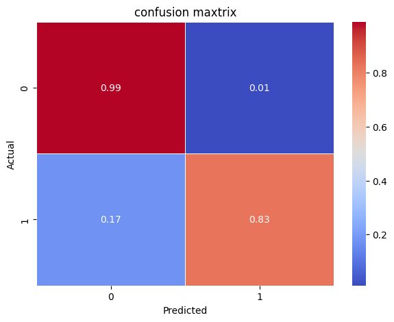
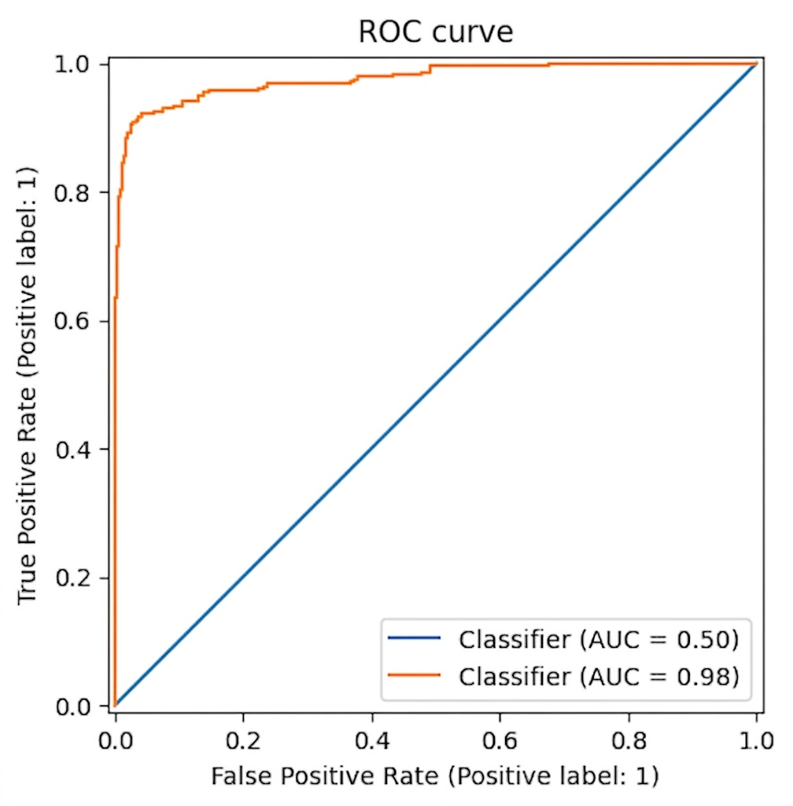

# 머신러닝 모델 평가 보고서
## 이커머스 고객 이탈 및 체리피커 예측을 위한 Light GBM 모델링

### 1.보고서 개요
* 본 보고서는 이커머스 플랫폼에서 이탈 고객(churn) 및 체리피커의 발생여부를 선제적으로 예측하기 위한 LightBGM 모델을 구축,평가한 전체 과정을 전체 서술함.
<br>
<br>
* 데이터 전처리부터 하이퍼 파라미터 최적화까지의 파이프라인과 최종 모델 성능을 정리함 
<br>
<br>

```text
데이터셋 개요
1.데이터셋 규모 5630개 데이터 * 20개 변수
2.타겟변수:Churn(0: 유지, 1: 이탈)
3.분할비율:Train 80%(4504건),Test 20%(1126건)
```
<br>
<br>
<br>
<br>

### 2.데이터셋 현황
#### 2-1. 주요 변수 현황
    |변수명|데이터 타입|설명|
    |------|-----------|----|
    |CustomerID|int32|고객 고유 식별자(학습X)|
    |Churn|int32|고객 이탈 여부(타겟)|
    |Tenure|float32|가입기간(월)|
    |PreferredLoginDevice|category|선호로그인 디바이스|
    |CityTier|int32|도시 등급(1-3)|
    |WarehouseToHome|float32|창고-자택 거리(km)|
    |PreferredPaymentMode|category|선호결제수단
    |Gender|category|성별
    |HourSpendOnApp|flaot32|앱 사용 시간
    |NumberOfDeviceRegistered|int32|등록기기수
    |PreferedOrderCat|category|선호주문카테고리
    |SatisfactionScore|int32|만족도 점수
    |MaritalStatus|category|혼인 여부
    |NumberOfAddress|int32|등록 주소 수
    |Complain|int32|불만 여부
    |OrderAmountHikeFromlastYear|flaot32|전년 대비 주문 금액 증가율
    |CouponUsed|flaot32|쿠폰 사용횟수
    |OrderCount|flaot32|주문 횟수
    |DaySinceLastOrder|flaot32|마지막 주문후 경과일
    |CashbackAmount|flaot32|캐시백 금액
<br>
<br>

#### 2-2.결측치 현환 및 처리 
* Train 세트에서 총 7개 수치형 피처에 걸쳐 결측치가 확인됨
* 그룹별 중앙값 대체 방식 및 전체 중앙값 기반 대체 방식을 혼용함

|피처|Train 결측|Test 결측|처리 방법
|------|-----------|----|------------|
|Tenure|213(4.7%)|51(4.5%)|NumberOfAddress 그룹별 중앙값   
|DaySinceLastOrder|247(5.5%)|60(5.3%)|PreferedOrderCat x LoginDevice 그룹별 중앙값
|OrderCount|212(4.7%)|46(4.1%)|PreferedOrderCat x PaymentMode 그룹별 중앙값
|OrderAmountHikeFromlastYear|208(4.6%)|57(5.1%)|PreferedOrderCat 그룹별 중앙값  
|WarehouseToHome|206(4.6%)|45(4.0%)|전체 중앙값
|HourSpendOnApp|197(4.4%)|58(5.2%)|전체 중앙값
|CouponUsed|208(4.6%)|48(4.3%)|전체 중앙값
<br>
<br>
<br>
<br>

### 3.데이터 전처리
#### 3-1 이상치 처리
* 4가지 수치형 피처에 대해 분포 형태에 따른 차별적 이상치 처리를 적용함

|피처|처리 방식|변환 후 피처명|이유
|------|-----------|----|------------|
|Tenure|로그 변환(log1p)|Tenure_log|우편향 분포 정규화
|WarehouseToHome|로그 변환(log1p)|WarehouseToHome_log|우편향 분포 정규화
|DaySinceLastOrder|IQR 클리핑|DaySinceLastOrder_clip|극단값 억제
|CashbackAmount|IQR 클리핑|CashbackAmount_clip|극단값 억제

#### 3-2 피처 엔지니어링
* EDA를 통해 담당자가 10가지의 신규피처를 생성함.

|피처명|수식|의미|
|-----|-----|----|
|Dormancy_Shock|DaySinceLastOrder / (avg_interval + 1)|평소 대비 이번 주문 공백의 충격 지수 (클수록 이탈 위험)
|Recency_Tenure_Ratio|	DaySinceLastOrder / actual_tenure|	가입기간 대비 최근 공백 비중 (신규 이탈 포착)
|MonthlyOrderFreq|	OrderCount / actual_tenure|	월평균 주문 빈도 (활동성)
|IssueIndex|	Complain (0/1)|	불만 제기 여부 (명시적 부정 경험)
|Satisfaction_Per_Order|	SatisfactionScore / (OrderCount + 1)|	주문 대비 체감 만족도 효율
|Silent_Killer|	Complain=0 AND SatisfScore≤2 → 1|	'조용한 이탈자' 후보 플래그
|CashbackPerOrder|	CashbackAmount / (OrderCount + 1)|	주문당 캐시백 체감도
|Promo_Sensitivity|	CouponUsed / (OrderCount + 1)|	프로모션 민감도
|Stagnant_Loyal|	Tenure≥30 AND MonthlyFreq < mean → 1|	정체된 장기 고객 플래그
|ManyAddressesFlag|	NumberOfAddress ≥ 3 → 1|	헤비 유저 여부

* 범주형 변수(PreferredLoginDevice, PreferedOrderCat, MaritalStatus, Gender)는 원-핫 인코딩을 적용하였음.
*  불필요한 원본 컬럼은 제거하여 최종 24개 피처로 학습을 진행함
<br>
<br>
<br>
<br>

### 4.모델링 및 학습
#### 4-1 모델선정
##### 4-1-1 Boosting 특성
 * weak learner 우선 생성후 Error 계산
 * Error에 기여한 sample마다 다른 가중치를 주고 해당 Error를 감소시키는 모델 학습 기법
 * 최초 모델이 오리지널 데이터를 기반으로 학습후 그 다음 모델부터 이전 학습에서 도출한 웨이트를 가지고 변경한 데이터를 통해 학습하고 변경하는것을 반복
 * 이를 통해 생성된 모든 모델이 학습데이터를 전부 다르게 학습함
 
 ##### 4-1-2 LightGBM 특성
 * LightGBM은 트리 기준 분할이 아닌 리프 기준 분할 방식을 이용함
 * 트리의 균형을 맞추지 않고 최대 손실 값을 갖는 리프 노드를 지속적으로 분할하면서 깊고 비대칭적인 생성
 * 이는 트리 기준 분할 방식에 비해서 예측오류손실을 최소화함
 * XGBoost보다 빠르며 메모리 사용량이 상대적으로 적기에 대용량 데이터 처리가 가능함
<br>
<br>
<br>

#### 4-2 교차 검증(Cross Validation)
* 기본 하이퍼파라미터를 적용하여 stratified 5-Fold 교차 검증 실시함

|구분|Train Accuracy|Validation Accuracy|Validation AUC|Test AUC
|------|-----------|----|------------|--------
|기본 LightGBM (CV 평균)|99.62%|94.16%|96.21|96.46

#### 4-3 베이지안 최적화(optuna)
* Optuna의 TPE 샘플러를 이용해 5회 탐색으로 최적 하이퍼 파라미터 탐색
* 목적 함수는 5-Fold Stratified CV의 ROC-AUC 평균임

|하이퍼파라미터|탐색범위|최적값|
|-----|-----|----|
|max_depth|2 ~ 5|5
|min_samples_split|	2 ~ 5|4
|criterion|	gini / entropy| entropy 
|max_leaf_nodes |5 ~ 10|9
|n_estimators |	10 ~ 460 (step=50)|	460
|learning_rate|	0.01 ~ 0.1|	0.08107934804645796

```text
optuna 최적 CV AUC:0.96214
50회 트라이얼 수행 — TPE 샘플러, 재현 가능한 시드(42) 고정
```

### 5.모델링 최종평가

#### 5-1. 종합 성능 지표

|지표|값|기준|
|-----|-----|----|
|model auc score|0.9756|test set
|model precision score|0.9438|test set
|model recall score|0.8275|test set
|model f1 score|0.8818|test set

<br>

#### 5-2.confusion matrix


#### 5-3.ROC curve



#### 5-4.모델분석
##### 5-4-1 종합 성능 평가
* 최종 모델은 Test set 기준 AUC 0.9756을 달성하였으며, 이는 이탈/비이탈 고객을 거의 완벽하게 변별하는 수준임.
* 교차검증 AUC(0.9621)와 Test AUC(0.9756) 간 격차가 0.014에 불과하여 과적합 없이 안정적으로 일반화된 모델임을 확일할수 있음.

##### 5-4-2 Confusion Matrix 해석
* Precision 0.9438은 모델이 이탈 예측을 하였을 때 오분류 비율이 약 5.6%에 불과함을 의미하며, 마케팅 개입 자원의 낭비를 최소화하는 데 유리함
* 반면 Recall 0.8275는 실제 이탈 고객 중 약 17%를 탐지하지 못함을 나타냄. * * 이탈 고객 조기 개입이 핵심 비즈니스 목표인 경우, 분류 임계값(기본값 0.5)을 0.3~0.4 수준으로 하향 조정하여 Recall을 높이는 방향을 검토할 필요가 있음.

##### 5-4-3  ROC Curve 해석
* ROC Curve는 FPR이 0.1 미만인 구간에서도 TPR이 0.85 이상을 유지하는 급격한 상승 패턴을 보이며, 이는 낮은 오탐률 하에서도 높은 탐지율을 확보할 수 있음을 의미함.
* AUC 0.9756은 이진 분류 실무 기준(AUC > 0.90)을 상회하는 우수한 수준임.

##### 5-4-4 피처 엔지니어링의 기여
* EDA를 통해 도출한 10개 신규 피처(Dormancy_Shock, Silent_Killer, Recency_Tenure_Ratio 등)와 그룹별 결측치 대체 전략이 모델 성능 안정화에 기여한 것으로 판단됨

### 6.결론
* 본 LightGBM 모델은 이커머스 고객 이탈 예측 과제에서 AUC 0.9756, F1-Score 0.8818로 실무 배포 기준을 충족하는 성능을 달성함. 
* 정밀도(0.9438)가 매우 높아 비이탈자에 대한 불필요한 개입을 억제하면서도, Recall의 소폭 한계는 임계값 조정을 통해 비즈니스 목표에 맞게 보완 가능함.
* 현 모델을 운영 환경에 배포하는 것을 권고되며, 배포 이후 실 이탈 데이터 축적에 따른 주기적 재학습(retraining) 파이프라인 구축을 병행할 것이 제안됨