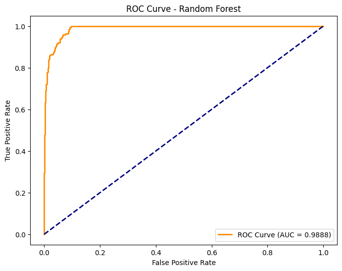
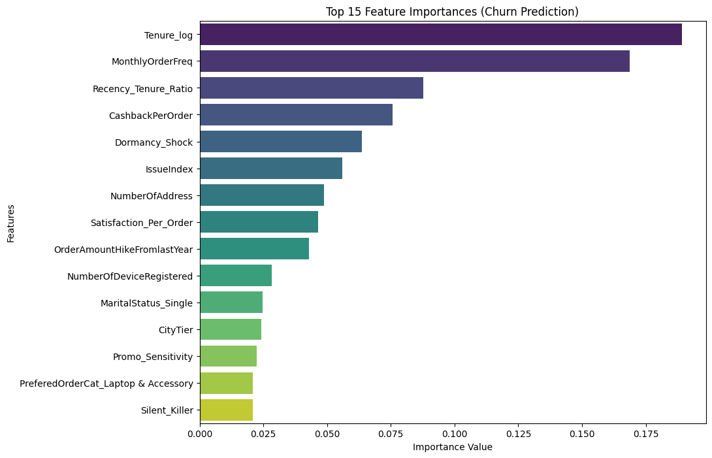

DCYH13e
m2k86_vnxths
온라인

박창제 — 2026-03-31 오후 12:48
네
DCYH13e — 2026-03-31 오후 4:39
창제님 'CustomerID
'이탈이유_1순위'
이탈이유_2순위
이탈확률
위험도
이걸로만 구성된 데이터 받을 수 있을까요?
저건 모델로 뽑아야할것같아서 제가 구성할 수가 없습니다 그리고 컬럼명은 영어로 하는게 나을것같습니다
지금 올려주신게 이탈확률과 위험도가 안보이는것같아서요
박창제 — 2026-03-31 오후 4:43
이탈확률넣으려고 합니다!
위험도는
뭘 말하는거죠???
DCYH13e — 2026-03-31 오후 4:43
예은님께 여쭤봐야할것같습니다
DCYH13e — 2026-03-31 오후 5:04
이탈확률만 하시면 될것같습니다
DCYH13e — 어제 오후 2:17
Streamlit에서 모델을 연결하는 핵심 구조를 단계별로 설명해 드릴게요. 코드를 직접 적어드리는 대신, 논리적인 흐름을 파악하실 수 있도록 구성했습니다.

라이브러리 임포트 및 캐싱 설정
가장 먼저 streamlit, pickle (또는 joblib), 그리고 모델이 사용하는 라이브러리(예: sklearn)를 불러와야 합니다.

이때 핵심은 모델 로드 함수를 별도로 만드는 것입니다. 이 함수 위에 @st.cache_resource를 붙여주세요. 이렇게 하면 앱이 새로고침될 때마다 무거운 모델 파일을 다시 읽어오는 낭비를 방지할 수 있습니다.

모델 파일 읽기 (Load)
함수 내부에서는 open('파일이름.pkl', 'rb') 형식을 사용합니다. 여기서 'rb'는 Read Binary를 의미하며, 피클링된 데이터를 복원할 때 필수적인 옵션입니다. pickle.load()를 통해 파일 내용을 변수에 할당하고 이를 반환(return)하도록 설계합니다.

사용자 입력 인터페이스 만들기
모델에 집어넣을 데이터를 사용자로부터 받아야 합니다. Streamlit의 다양한 위젯을 활용해 보세요.

숫자 데이터: st.number_input이나 st.slider

카테고리 데이터: st.selectbox나 st.radio
이렇게 받은 값들을 리스트나 넘파이 배열(Numpy Array) 형태로 묶어줍니다.

예측 실행 및 결과 출력
사용자가 '예측하기' 버튼(st.button)을 눌렀을 때만 동작하도록 조건문을 만듭니다.
조건문 안에서는 미리 로드해둔 모델 객체의 .predict() 메서드를 호출합니다. 이때 입력값의 차원(Shape)이 모델 학습 시와 일치하는지 꼭 확인해야 합니다. (보통 2차원 배열 형태인 [[값1, 값2...]] 형식을 요구합니다.)

마지막으로 예측된 결과값을 st.write나 st.success를 이용해 화면에 멋지게 띄워주면 완성입니다.
박창제 — 오전 9:44
# Random Forest 모델 평가 분석 보고서

## 1. 모델 개요

### 1.1 알고리즘 개요

message.txt
7KB
# Random Forest 모델 평가 분석 보고서

## 1. 모델 개요

### 1.1 알고리즘 개요
랜덤 포레스트(Random Forest)는 다수의 의사결정 트리(Decision Tree)를 결합한 앙상블(Bagging) 기반 분류 모델

### 1.2 작동 원리
- **부트스트랩 샘플링**: 원본 데이터에서 중복을 허용하여 여러 개의 학습 데이터셋을 무작위 생성
- **랜덤 피처 선택**: 각 트리의 분기마다 전체 피처 중 일부만 무작위로 선택
- **다수결 투표**: 각 트리의 예측 결과를 집계하여 최종 분류 결정

### 1.3 이탈 예측 문제에 적합한 이유
- 피처 간 비선형 관계를 자연스럽게 포착 가능
- 피처 중요도(Feature Importance)를 직접 제공하여 해석에 활용 가능
- `class_weight` 파라미터로 클래스 불균형 문제에 직접 대응 가능

---

## 2. 모델 설계

### 2.1 하이퍼파라미터 설정 및 선택 근거

| 파라미터 | 설정값 | 선택 이유 |
|---|---|---|
| `n_estimators` | 100 | 속도와 성능의 균형점 |
| `max_depth` | 12 | 트리 깊이 제한으로 과적합 방지 |
| `class_weight` | `balanced` | 이탈(1) 소수 클래스 보정 |
| `random_state` | 42 | 실험 재현성 확보 |

### 2.2 클래스 불균형 대응 전략
데이터셋 내 이탈(1) 클래스는 전체의 약 16.9%로 유지(0) 클래스에 비해 현저히 적음.
단순 학습 시 다수 클래스에 편향될 수 있으므로, `class_weight='balanced'`를 적용함

### 2.3 학습 / 테스트 분할

| 구분 | 건수 | 비율 |
|---|---|---|
| 전체 데이터 | 5,630건 | — |
| 학습 데이터 (Train) | 4,504건 | 80% |
| 테스트 데이터 (Test) | 1,126건 | 20% |

> `stratify=y` 옵션 적용 → 분할 후에도 이탈/유지 비율이 원본과 동일하게 유지됨

---

## 3. 평가 지표 해석

### 3.1 사용 지표 선정 이유
이탈 예측 문제에서는 **FN(실제 이탈인데 유지로 예측)** 의 비용이 큼.
이탈 고객을 놓치면 대응 기회를 잃기 때문에, Accuracy만 사용하기 보다는 **Recall, F1-Score, AUC** 를 중심으로 평가함

### 3.2 분류 보고서 (Classification Report)

| 클래스 | Precision | Recall | F1-Score | Support |
|---|---|---|---|---|
| 0 (유지) | 0.97 | 0.98 | 0.98 | 936 |
| 1 (이탈) | 0.90 | 0.86 | 0.88 | 190 |
| **Accuracy** | | | **0.96** | 1,126 |
| Macro Avg | 0.93 | 0.92 | 0.93 | 1,126 |
| Weighted Avg | 0.96 | 0.96 | 0.96 | 1,126 |

### 3.3 혼동 행렬 (Confusion Matrix)

|  | 예측: 유지 (0) | 예측: 이탈 (1) |
|---|---|---|
| **실제: 유지 (0)** | 98.0% (917건) | 2.0% (19건) |
| **실제: 이탈 (1)** | 14.2% (27건)  | 85.8% (163건) |

> 실제 이탈 고객 190명 중 27명(14.2%)을 유지 고객으로 잘못 예측(FN)

### 3.4 ROC Curve & AUC Score

- **Test AUC: 0.9888**
- ROC 커브가 좌상단에 매우 근접 → 이탈/유지 클래스를 잘 구분하고 있음

### 3.5 Precision-Recall Curve & AP Score

- 불균형 클래스 관점에서 AUC 수치 보완
- PR Curve 면적(AP Score)이 높을수록 소수 클래스(이탈) 탐지 성능이 우수함을 의미

---

## 4. 과적합 진단

### 4.1 Train vs Test AUC 비교

| 구분 | AUC |
|---|---|
| Train | 0.9998 |
| Test | 0.9888 |
| 점수 차이 | 0.0110 |

> 일반적으로 Gap이 **0.05(5%) 이내**이면 과적합 없이 안정적인 모델로 판단함.
> 본 모델의 Gap은 **0.011**로 기준치를 크게 하회하여 일반화 성능이 확인됨.

### 4.2 5-Fold 교차 검증 결과

| Fold | AUC |
|---|---|
| Fold 1 | 0.9967 |
| Fold 2 | 0.9953 |
| Fold 3 | 0.9902 |
| Fold 4 | 0.9930 |
| Fold 5 | 0.9909 |
| **평균** | **0.9932** |
| **표준편차** | **0.0025** |

### 4.3 종합 판단
- CV 평균 AUC **0.9932**, 표준편차 **0.0025**
- 폴드 간 편차가 매우 작아 특정 데이터 분할에 의존하지 않는 **안정적인 일반화 성능** 확인함
- Train-Test Gap과 교차 검증 결과를 종합할 때 과적합 없이 신뢰할 수 있는 모델로 판단됨

---

## 5. 피처 중요도 분석

### 5.1 Top 15 피처 중요도

> 시각화: `Top 15 Feature Importances (Churn Prediction)` 바 차트 참고

### 5.2 상위 피처 해석

| 피처 | 해석 |
|---|---|
| `Tenure_log` | 가입 기간이 짧을수록 이탈 위험 ↑ |
| `MonthlyOrderFreq` | 주문 빈도 감소 → 이탈 전조 신호 |
| `Recency_Tenure_Ratio` | 장기 고객의 갑작스러운 접속 단절 탐지 |
| `CashbackPerOrder` | 캐시백 의존도 높은 체리피커 패턴 |
| `Dormancy_Shock` | 평소 대비 급격한 접속 공백 발생 |
| `IssueIndex` | 불만/문의 이력이 이탈과 연결 |
| `Satisfaction_Per_Order` | 주문당 만족도 저하 → 이탈 신호 |

### 5.3 체리피커 패턴 정의
혜택(쿠폰, 캐시백)은 충분히 수령하면서 정작 구매는 적고 빠르게 이탈하는 고객 유형.
아래 피처 조합으로 탐지 가능할 것으로 판단됨

- `Tenure_log`(낮음) + `CashbackPerOrder`(높음) → 가입 기간은 짧은데 캐시백 수령량이 많은 고객
- `MonthlyOrderFreq`(낮음) + `Recency_Tenure_Ratio`(높음) → 평소 주문은 거의 없으나 특정 시점에만 구매가 집중되는 고객
- `Promo_Sensitivity`(높음) → 프로모션 기간에만 반응하는 고객

---

## 6. SHAP를 통한 분석 

- Tenure (가입 기간): 결정적 feature. 가입 기간이 짧을수록(Blue) 이탈 확률(SHAP value > 0)이 급격히 높아지며, 장기 고객일수록(Red) 이탈 가능성이 현저히 낮아지는 '신규 고객 중심 이탈' 패턴
- Complain (불만 여부): 불만 제기 이력(Red, 1)이 있는 경우 SHAP 값이 양수 방향으로 뚜렷하게 쏠려 있습니다. 이는 불만 발생이 즉각적인 이탈의 주요 요인
- CashbackAmount (캐시백 금액): 캐시백 혜택을 많이 받는 고객(Red)일수록 이탈 확률이 낮아지는(Left side) 경향이 보입니다. 이는 혜택 기반의 고객 락인(Lock-in) 효과가 작동하고 있음
- WarehouseToHome (배송 거리): 창고와의 거리가 멀수록(Red) 이탈 확률이 소폭 상승하는 분포를 보입니다. 물류 효율성이 고객 유지에 미치는 영향 확인

---

## 7. 모델 총평 및 한계

### 7.1 성능 요약

| 지표 | 값 |
|---|---|
| Accuracy | 0.96 |
| F1-Score (이탈) | 0.88 |
| ROC-AUC | 0.9888 |
| CV 평균 AUC | 0.9932 |
| Train-Test Gap | 0.0110 |
message.txt
7KB
