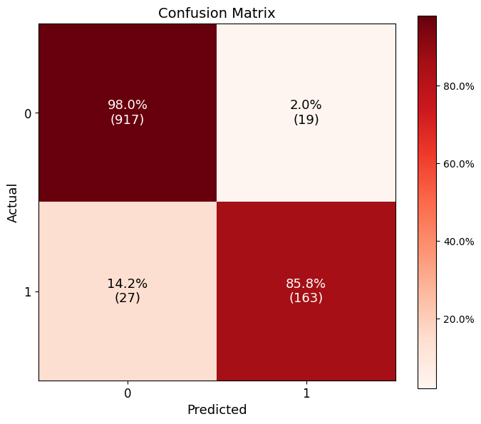
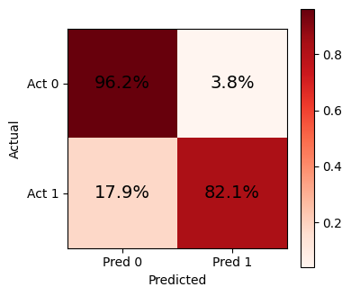
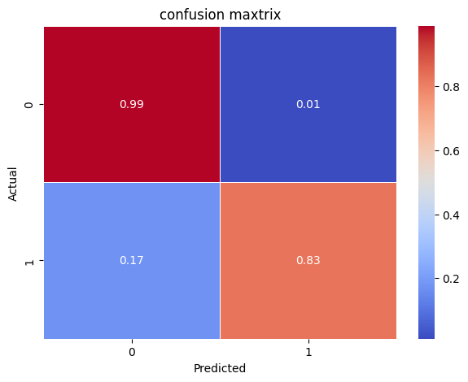
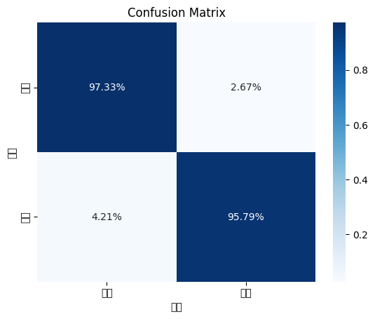

<!-- _class: title -->
<!-- _paginate: false -->

🛒 E-Commerce Churn Solution

# 고객 이탈 예측 플랫폼 Re:tain

데이터 기반 고객 유지 전략으로 이커머스의 미래를 만듭니다

  👥 SKN27기 4팀
  |
  김민경 · 박준희 · 박창제 · 임예은 · 한재웅
  |
  2026. 04. 02

---

AGENDA 목차

  
01

  
<h3>프로젝트 개요</h3>
배경 · 목적 · 팀 구성

  
02

  
<h3>데이터 & 전처리</h3>
결측치 처리 · 이상치 제어 · EDA

  
03

  
<h3>피처 엔지니어링</h3>
10개 파생 변수 설계 · 최종 24개 피처

  
04

  
<h3>모델링 & 성능 비교</h3>
RF · XGBoost · LightGBM · MLP

  
05

  
<h3>최종 모델 선정</h3>
XGBoost · AUC 0.995 · SHAP 분석

  
06

  
<h3>서비스 아키텍처</h3>
Re:tain 플랫폼 · Streamlit · DB

---

01 프로젝트 개요

  
🔍 문제 정의

  

    
이커머스에서 <strong>고객 이탈(Churn)</strong>은 비즈니스의 직접적 손실로 이어집니다.

| 구분 | 내용 |
|------|------|
| 비용 문제 | 신규 고객 유치 비용 ≒ 유지 비용의 5~7배 |
| 탐지 어려움 | 체리피커(혜택만 수령 후 이탈) 식별 불가 |
| 대응 한계 | 이탈 사후 대응은 ROI 낮음 |

  

  
🎯 프로젝트 목적

  

    
<strong>머신러닝 기반 이탈 예측 모델</strong>로 선제적 고객 관리 체계 구축

| 목표 | 세부 내용 |
|------|----------|
| 모델 비교 | RF / XGBoost / LightGBM / MLP |
| 피처 설계 | 파생 변수 10개로 이탈 패턴 포착 |
| 플랫폼 구현 | Re:tain 대시보드로 실시간 이탈 예측 |

  

---

02 데이터 개요

  

5,630

전체 데이터 건수

  

20개

원본 피처 수

  

16.9%

이탈 고객 비율 (Churn=1)

  

80/20

Train / Test 분할 비율

| 주요 변수 | 타입 | 설명 |
|-----------|------|------|
| `Churn` | int | 타겟 변수 — 이탈(1) / 유지(0) |
| `Tenure` | float | 가입 기간 (월) |
| `OrderCount` | float | 주문 횟수 |
| `SatisfactionScore` | int | 만족도 점수 (1–5) |
| `CashbackAmount` | float | 캐시백 금액 |
| `DaySinceLastOrder` | float | 마지막 주문 후 경과일 |
| `Complain` | int | 불만 제기 여부 (0/1) |

---

02 데이터 전처리

  
💊 결측치 처리 — 그룹별 중앙값 대체

  

| 피처 | 결측률 | 처리 방법 |
|------|--------|-----------|
| `Tenure` | 4.7% | NumberOfAddress 그룹 중앙값 |
| `DaySinceLastOrder` | 5.5% | 카테고리×로그인기기 중앙값 |
| `OrderCount` | 4.7% | 카테고리×결제수단 중앙값 |
| `OrderAmountHike` | 4.6% | 카테고리 그룹 중앙값 |
| `HourSpendOnApp` | 4.4% | 전체 중앙값 |
| `CouponUsed` | 4.6% | 전체 중앙값 |

  

  
📐 이상치 처리 — 분포 기반 차별 적용

  

| 피처 | 처리 방식 | 변환 피처명 |
|------|-----------|-------------|
| `Tenure` | 로그 변환 (`log1p`) | `Tenure_log` |
| `WarehouseToHome` | 로그 변환 (`log1p`) | `WH_log` |
| `DaySinceLastOrder` | IQR 클리핑 | `Days_clip` |
| `CashbackAmount` | IQR 클리핑 | `Cashback_clip` |

💡 우편향 분포 → 로그 정규화 / 극단값 → IQR 억제

  

---

03 피처 엔지니어링

EDA 기반 이탈 예측력 강화를 목적으로 함

  

    <h3>행동 패턴 (4개)</h3>
    <ul>
      <li><strong>Dormancy Shock</strong>: 평소 대비 주문 공백의 충격 지수</li>
      <li><strong>Recency Tenure Ratio</strong>: 가입기간 대비 최근 공백 비중</li>
      <li><strong>MonthlyOrderFreq</strong>: 월평균 주문 빈도</li>
      <li><strong>Stagnant Loyal</strong>: 정체된 장기 고객 (가입은 오래됐지만 활동은 평균 이하)</li>
    </ul>
  

  

    <h3>만족도 &amp; 경험 (3개)</h3>
    <ul>
      <li><strong>Satisfaction_Per_Order</strong>: 주문당 만족도 효율</li>
      <li><strong>Silent Killer</strong>: 조용한 이탈자 (불만은 낮지만 만족도 낮음)</li>
      <li><strong>IssueIndex</strong>: 불만 제기 여부 (명시적인 부정적 경험)</li>
    </ul>
  

  

    <h3>가치 &amp; 반응성 (3개)</h3>
    <ul>
      <li><strong>CashbackPerOrder</strong>: 주문당 캐시백 체감도</li>
      <li><strong>Promo_Sensitivity</strong>: 프로모션 민감도</li>
      <li><strong>ManyAddressesFlag</strong>: 배송지가 많음 (헤비 유저 여부)</li>
    </ul>
  

  <strong>최종 처리</strong> &nbsp;|&nbsp; 카테고리 피처에 원-핫 인코딩 적용 → 불필요 컬럼 제거 → 최종 <strong>24개 피처</strong>로 모델 학습

---

04 모델링 및 평가

| 모델명 | 특장점 | 사용 기법 | 하이퍼 파라미터 튜닝 |
|---|---|---|---|
| **Random Forest (박준희)** | 비선형 학습, 안정적 | Manual Search CV | `n_estimators=100, max_depth=12,` `class_weight='balanced', random_state=42` |
| **XGBoost(박창제)** | 최고 정확도, 정규화 | Grid Search CV | `colsample_bytree=0.9, learning_rate=0.1,` `max_depth=5, n_estimators=300, subsample=0.9` |
| **LightGBM(한재웅)** | 빠른 학습, 메모리 효율 | Bayesian Search CV | `max_depth=5, min_samples_split=4,` `criterion='entropy', max_leaf_nodes=9,` `n_estimators=460, learning_rate=0.0811` |
| **다층 퍼셉트론 (MLP, 김민경)** | 배포 용이, 실시간 | Standard Scaler, Grid Search CV | `alpha=0.0001,` `hidden_layer_sizes=(50,50),` `learning_rate_init=0.01` |

---

04 혼동행렬 (Confusion Matrix) 비교

  

    
    
Random Forest

  

  

    
    
MLP

  

  

    
    
LightGBM

  

  

    
    
XGBoost (Best)

  

---

04 팀원 모델링 비교: AUC 성능

  

    
⚡ XGBoost

    

    
0.995

  

  

    
🧠 MLP

    

    
0.980

  

  

    
🚀 LightGBM

    

    
0.970

  

  

    
🌲 Random Forest

    

    
0.900

  

  ✓ XGBoost &nbsp;|&nbsp; AUC 0.995 &nbsp;|&nbsp; 최종 선택 모델 ⭐

