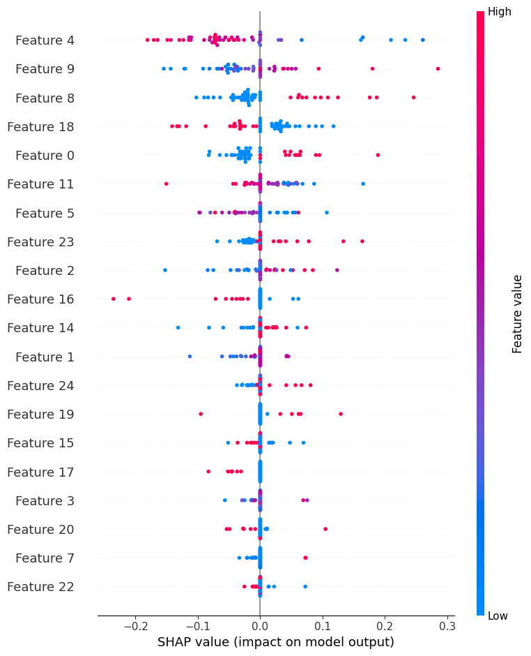

# 피처 생성 검증 보고서

**대상:** `src/pipeline/features.py`의 `FeatureCreate` 및 선행 단계 `OutlierControl`  
**연계 문서:** `doc/columns.md` (피처 정의 요약표)  
**작성 목적:** 입력 전제, 산출물, 데이터 누수·일관성 검증 포인트 정리

---

## 1. 파이프라인 상 위치

`FeatureCreate`는 다음 **전제**를 만족한 뒤 호출된다.

1. **결측 처리** 완료 (`CJ_MissingValue`, `JH_MissingValue`)
2. **이상치·스케일 완화** (`OutlierControl`)  
   - `Tenure`, `WarehouseToHome` → `*_log` (`log1p`)  
   - `DaySinceLastOrder` → `DaySinceLastOrder_clip` (상한 18 등 고정 clip)  
   - `CashbackAmount` → `CashbackAmount_clip` (고정 구간 clip)  
   - 원본 수치 컬럼은 `OutlierControl` 내에서 제거될 수 있음

`FeatureCreate`는 위에서 생성된 **`Tenure_log`**, **`DaySinceLastOrder_clip`**, **`CashbackAmount_clip`**, **`OrderCount`** 등을 직접 사용한다.

---

## 2. 핵심 파생 변수와 수식

| 피처명 | 계산 요지 (코드 기준) | 검증 포인트 |
|--------|------------------------|-------------|
| `actual_tenure` | `expm1(Tenure_log)`, 하한 clip | 로그 역변환 후 0 나눗셈 방지 |
| `denom_order` | `OrderCount + 1` | 0으로 나누기 방지 |
| `avg_interval` | `actual_tenure / denom_order` (하한 clip) | 평균 주문 간격 대용 |
| `Dormancy_Shock` | `DaySinceLastOrder_clip / (avg_interval + 1)` | 최근 공백이 평소 대비 얼마나 큰지 |
| `Recency_Tenure_Ratio` | `DaySinceLastOrder_clip / actual_tenure` | 가입 대비 최근 공백 비중 |
| `MonthlyOrderFreq` | `OrderCount / actual_tenure` | 월별 주문 빈도 대용 |
| `IssueIndex` | `Complain` 정수화 | 불만 여부 |
| `Satisfaction_Per_Order` | `SatisfactionScore / denom_order` | 건당 만족도 |
| `Silent_Killer` | 불만 없음 & 만족도 ≤ 2 | 이진 플래그 |
| `CashbackPerOrder` | `CashbackAmount_clip / denom_order` | 건당 캐시백 |
| `Promo_Sensitivity` | `CouponUsed / denom_order` | 건당 쿠폰 사용 |
| `Stagnant_Loyal` | `actual_tenure ≥ 30` & `MonthlyOrderFreq < 기준` | **기준은 아래 3절** |
| `ManyAddressesFlag` | `NumberOfAddress ≥ 3` | 다주소 이용 |

범주형: `PreferredLoginDevice`, `PreferedOrderCat`, `MaritalStatus`, `Gender`에 대해 `pd.get_dummies(..., drop_first=True)`.

---

## 3. Train/Test 일관성 (누수 방지)

### 3.1 `Stagnant_Loyal`의 기준값

- `MonthlyOrderFreq`의 비교 기준 `_mean_mof`는  
  - **train에서만** `FeatureCreate(X_train)` 후 `X_train['MonthlyOrderFreq'].mean()`으로 구하고  
  - **test**에는 `FeatureCreate(X_test, train_monthly_freq_mean=_mof_mean)`로 전달한다.
- 이렇게 하면 **test 분포로 평균을 재계산하지 않으므로**, 전형적인 **전처리 누수**에 해당하지 않는다.

### 3.2 더미 변수 컬럼 정렬

- `get_dummies` 후 train과 test 간 컬럼 수가 달라질 수 있으므로, 노트북에서  
  `X_test.reindex(columns=X_train.columns, fill_value=0)`  
  로 **train 스키마에 맞춘다.**  
- 검증: test에만 나타나는 더미는 0으로 채워지고, train에만 있던 더미는 test에 반영된다.

---

## 4. 학습에서 제외되는 컬럼 (`drop_cols`)

다음은 파생에 쓰인 뒤 **최종 프레임에서 제거**된다 (존재할 때만).

`DaySinceLastOrder_clip`, `Complain`, `SatisfactionScore`, `CashbackAmount_clip`, `OrderCount`, `CouponUsed`, `WarehouseToHome_log`, `RecentActive`, `HourSpendOnApp`, `is_newbie_risk`, `RoughLTV`, `PreferredPaymentMode`

→ 모델에 들어가는 것은 **파생 변수·남은 원본·원-핫 결과**의 조합이다.

---

## 5. 정성 검증 체크리스트

| 항목 | 확인 사항 |
|------|-----------|
| 정의 일관성 | `doc/columns.md` 표의 비즈니스 의미와 코드 수식이 일치하는지 |
| 선행 조건 | `OutlierControl` 실행 여부 및 `_log` / `_clip` 컬럼 존재 |
| 이탈 정의 | `Churn`과 동시점·사후 정보가 아닌지 (도메인 검토) |
| 분할 | 무작위 split vs 시간 split 요구 여부 |
| 실험 반복 | 시드 고정 시 파이프라인 재현 가능 여부 |

---

## 6. 알려진 설계 특성 (한계 아님, 해석용)

1. **`DaySinceLastOrder` 상한 clip**  
   긴 공백이 모두 상한으로 묶이므로, 극단적 장기 미주문 정보는 일부 뭉개진다. 이탈과 강하게 연결된 꼬리라면, 도메인과 함께 상한 값을 검토할 수 있다.

2. **`Stagnant_Loyal`의 “30”**  
   `actual_tenure >= 30`은 코드 상 고정이다. 단위(일/월 등)는 원 데이터 `Tenure` 정의와 일치해야 한다.

3. **선택적 피처 제거·라벨 셔플** 등은 **7절**에서 정리한다.

---

## 7. 데이터 누수 의심 검증 (테스트 내용·결과)

피처·전처리가 **타깃 정보를 불법적으로 반영하지 않는지** 확인하기 위해, 코드 점검과 **라벨 셔플** 테스트를 병행한다.  
(“누수 없음”의 수학적 증명은 아니며, **이상 징후를 걸러내는 실무 절차**로 본다.)

### 7.1 전처리·피처 단계 점검 (정적)

| 검사 항목 | 내용 | 판단 |
|-----------|------|------|
| 결측 (JH) | `JH_train_stats`는 **train만** 사용, 동일 인자로 train/test 적용 | 테스트 분포로 통계 추정 없음 |
| 결측 (CJ) | 그룹 보정은 train에만; test NaN은 **train 전역 중앙값** 등으로 처리 | 전형적 누수 패턴 아님 |
| `Stagnant_Loyal` | `MonthlyOrderFreq` 평균은 **train에서만** 산출 후 test에 전달 | 테스트 기준값 누수 방지 |
| 더미 정렬 | `X_test.reindex(columns=X_train.columns, fill_value=0)` | 스키마 일치 |
| 스케일러 | `fit`은 train, `transform`만 test | 표준 절차 충족 |
| 이상치 (`OutlierControl`) | **고정** clip·`log1p` (train 분위수로 임계값 추정 없음) | 전처리 누수 해당 없음 |

### 7.2 라벨 셔플 테스트 (실행 기반)

**목적:** 학습 라벨이 **무작위로 섞였을 때** test에서 ROC-AUC가 **우연 수준(~0.5)** 으로 떨어지면, “X와 y가 우연히 맞물린 가짜 상관” 가능성은 낮다고 본다.  
반대로 **여전히 매우 높은 AUC**가 나오면, 특성·데이터 구조·중복·도메인 누수 등을 추가 점검한다.

**절차 (`src/modeling/MLP.ipynb`):**

1. 동일 `X_train_scaled`, `X_test_scaled` 유지  
2. `y_train`만 `RandomState(42)`로 무작위 순열  
3. `clone(best_mlp)`로 동일 구조 모델을 **셔플 라벨**로 재학습  
4. **test는 원래 `y_test`** 로 `roc_auc_score` 계산  

**저장된 실행 결과 (참고):**

| 지표 | 값 |
|------|-----|
| AUC (라벨 셔플 후 학습 / test는 원 라벨) | **0.4639** |

**해석 (참고 실행 기준):**

- 약 **0.46**은 이진·클래스 비율에 따라 **0.5 근처의 무의미한 구분력**에 해당한다.
- 동일 파이프라인에서 **정상 라벨 학습 시 test ROC-AUC는 약 0.95 전후**로 보고된 바 있어, **라벨이 깨지면 성능이 사라지는** 패턴과 일치한다.
- 따라서 **“라벨과 무관한 우연 적합만으로 나온 고성능”** 가능성은 낮다고 **보조적으로** 판단할 수 있다.  
  (단, **단일 피처가 타깃을 직접 반영**하는 누수는 별도로 컬럼 정의·수집 시점 검토가 필요하다.)

### 7.3 누수 의심 피처 제거 실험

**목적:** 행동·최근성·금액과 연관된 피처를 빼도 성능이 **비정상적으로만 유지되는지** 대조한다. (고성능 자체가 누수는 아니며, **제거 시 얼마나 깨지는지**로 피처 기여도를 본다.)

**초기에 “선택”으로 적어 두었던 이유:** 자동 파이프라인에 포함된 검증이 아니라, **노트북에서 수동으로 돌리는 대조 실험**이었고, 저장소에 **고정된 수치를 두지 않은 상태**였기 때문이다. 아래는 동일 코드·데이터로 **재현한 결과**를 기록한 것이다.

**절차:** `MLP.ipynb` 실험용 셀과 동일하게, 후보 목록 중 **현재 `X_train`에 실제로 존재하는 컬럼만** 제거 → `StandardScaler`를 train에 다시 `fit` → 동일 `param_grid`로 `GridSearchCV`(cv=3, scoring=`f1`) → 테스트 세트에 ROC-AUC·F1(임계값 0.5).

**후보 목록 (`final_drop_list`):**

`CashbackAmount_clip`, `CashbackAmount`, `DaySinceLastOrder_clip`, `DaySinceLastOrder`, `OrderCount`, `Tenure_log`, `Tenure`, `MonthlyOrderFreq`, `CashbackPerOrder`, `Dormancy_Shock`, `Stagnant_Loyal`, `OrderAmountHikeFromlastYear`

**실제로 제거된 컬럼:** 
- `Tenure_log`, `MonthlyOrderFreq`, `CashbackPerOrder`, `Dormancy_Shock`, `Stagnant_Loyal`, `OrderAmountHikeFromlastYear`

**재현 조건:** `data/dataset.xlsx`, `train_test_split(test_size=0.2, random_state=42, stratify=y)`, `set_seed(42)`, `MLPClassifier(max_iter=500, random_state=42)`, GridSearch `param_grid`는 `MLP.ipynb`와 동일.

**실험 결과 (재현 실행):**

| 구분 | 피처 수 | CV 최선 F1 (평균, 3-fold) | 테스트 ROC-AUC | 테스트 F1 (임계값 0.5) |
|------|---------|---------------------------|----------------|-------------------------|
| **기본 (드롭 없음)** | 25 | 0.7660 | 0.9688 | 0.8168 |
| **누수 의심 후보 드롭 후** | 19 | 0.6532 | 0.9436 | 0.7263 |

**최적 하이퍼파라미터 (해당 실행):**

- 기본: `alpha=0.001`, `hidden_layer_sizes=(50, 50)`, `learning_rate_init=0.01`
- 드롭 후: `alpha=0.001`, `hidden_layer_sizes=(64, 32)`, `learning_rate_init=0.01`

**해석:**

- 위 6개를 제거해도 ROC-AUC **0.94대**로 남아, 모델은 **여전히 강한 구분력**을 가진다. → “이 피처들만으로 점수가 전부 나온다”는 식의 단순 설명은 어렵고, **다른 피처·조합**이 충분히 신호를 제공한다.
- 동시에 CV F1·테스트 F1·AUC가 **모두 하락**하므로, 제거한 변수들은 **정당한 예측 신호에도 기여**하고 있음을 시사한다. (성능 하락 = 누수 증거가 **아님**.)

**노트북 셀 정리:** 후보 리스트에 `FeatureCreate` 이전 단계 컬럼명이 섞여 있으면, **실제 드롭 개수가 의도와 다르게 보일 수 있으므로**, 실험 시 `actual_drop = [c for c in final_drop_list if c in X_train.columns]`를 출력해 확인하는 것이 좋다.

---

## 8. 관련 파일

| 파일 | 역할 |
|------|------|
| `src/pipeline/features.py` | `FeatureCreate` 구현 |
| `src/pipeline/outlier_control.py` | 선행 clip·log |
| `src/pipeline/missing_value.py` | 선행 결측 처리 |
| `src/modeling/MLP.ipynb` | `_mof_mean` 전달, `reindex`, 학습, **7.2·7.3** 검증 셀 |
| `doc/columns.md` | 피처 정의 요약 |
| `doc/MLP_modeling_evaluation_report.md` | 모델 평가 보고서 |

---

*본 문서는 현재 저장소의 `FeatureCreate` 구현 및 `MLP.ipynb` 검증 셀을 기준으로 하며, 코드·실행 결과 변경 시 함께 갱신한다.*

